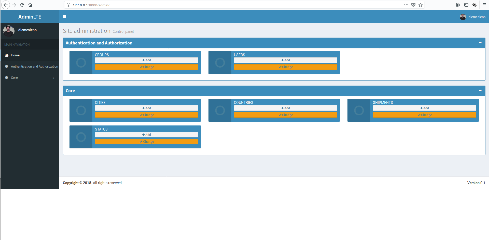

# Simple Shipments API Test 
> Django App 

### Task Description

## Python Developer Challenge
Please create REST API functionality to maintain a list of shipments 
(fields are freetext fields, up to your choice).

### Requirements

* Required functionality: list, retrieve, create, update.
* Python language with utilization of Django REST framework.
* No forms should be used
* Include tests (pytest, or phpunit, or etc).


### Notes

Code must be provided in a zip file.


## Technologies utilized
* Python 3.6.5
* Django 2.0.7
* PostgreSQL 10+

### Test Environment

### Installation

Any Operating System with docker/docker-compose installed:

```
a) git clone https://github.com/diemesleno/kuehne.git

b) cd kuehne

c) ./run.sh
```

### How to Use it

Recomended to use Postman (https://www.getpostman.com) 

## Country Endpoints:
```
[GET, POST]

http://127.0.0.1:8000/api/v1/country/
GET - To get the list of countries available

Exemple of data received:

[
    {
        "id": 1,
        "name": "Brazil"
    },
    {
        "id": 2,
        "name": "Estonia"
    },
    {
        "id": 3,
        "name": "Germany"
    }
]

http://127.0.0.1:8000/api/v1/country/
POST - To create a new country

Example data to send:

{
    "name": "Paraguay"
}

Example data received:

{
    "id": 4,
    "name": "Paraguay"
}

[GET, PUT, DELETE]

http://127.0.0.1:8000/api/v1/country/<int:pk>/
GET - Get a country by pk

Example of data received:

[
    {
        "id": 1,
        "name": "Brazil"
    }
]

http://127.0.0.1:8000/api/v1/country/<int:pk>/
PUT - To Update a country

Example data to send:

{
    "name: "Estonia"
}

Example of data received:

{
    "id": 1,
    "name": "Estonia"
}

http://127.0.0.1:8000/api/v1/country/<int:pk>/
DELETE - Delete a country by pk
```

## City Endpoints:
```
[GET, POST]

http://127.0.0.1:8000/api/v1/city/
GET - To get the list of cities available

Exemple of data received:

[
    {
        "id": 5,
        "country_name": "Germany",
        "name": "Berlin"
    },
    {
        "id": 6,
        "country_name": "Germany",
        "name": "Frankfurt"
    },
    {
        "id": 2,
        "country_name": "Test",
        "name": "Rio de Janeiro"
    },
    {
        "id": 1,
        "country_name": "Test",
        "name": "São Paulo"
    },
    {
        "id": 3,
        "country_name": "Estonia",
        "name": "Tallin"
    },
    {
        "id": 4,
        "country_name": "Estonia",
        "name": "Tartu"
    }
]

http://127.0.0.1:8000/api/v1/city/
POST - To create a new city

Example data to send:

{
    "name": "Ituiutaba",
    "country": 1
}

Example data received:

{
    "id": 7,
    "country_name": "Brazil",
    "name": "Ituiutaba"
}

[GET, PUT, DELETE]

http://127.0.0.1:8000/api/v1/city/<int:pk>/
GET - Get a city by pk

Example of data received:

[
    {
        "id": 7,
        "country_name": "Brazil",
        "name": "Ituiutaba"
    }
]

http://127.0.0.1:8000/api/v1/city/<int:pk>/
PUT - To Update a city

Example data to send:

{
    "name: "Tallin",
    "country: 1
}

Example of data received:

{
    "id": 7,
    "country_name", "Brazil",
    "name": "Tallin"
}

http://127.0.0.1:8000/api/v1/city/<int:pk>/
DELETE - Delete a city by pk
```

## Status Endpoints:
```
[GET, POST]

http://127.0.0.1:8000/api/v1/status/
GET - To get the list of status available

Exemple of data received:

[
    {
        "id": 2,
        "name": "Delivered"
    },
    {
        "id": 1,
        "name": "In Transit"
    }
]

http://127.0.0.1:8000/api/v1/status/
POST - To create a new status

Example data to send:

{
    "name": "Missed"
}

Example data received:

{
    "id": 3,
    "name": "Missed"
}

[GET, PUT, DELETE]

http://127.0.0.1:8000/api/v1/status/<int:pk>/
GET - Get a status by pk

Example of data received:

[
    {
        "id": 1,
        "name": "In Transit"
    }
]

http://127.0.0.1:8000/api/v1/status/<int:pk>/
PUT - To Update a status

Example data to send:

{
    "name: "Possible to Delay"
}

Example of data received:

{
    "id": 1,
    "name": "Possible to Delay"
}

http://127.0.0.1:8000/api/v1/status/<int:pk>/
DELETE - Delete a status by pk
```

## Shipment Endpoints:
```
[GET, POST]

http://127.0.0.1:8000/api/v1/
GET - To get the list of shipments available

Exemple of data received:

[
    {
        "object_number": "120035339828",
        "status_name": "Delivered",
        "actual_location_name": "Tallin",
        "next_location_name": "Berlin",
        "updated": "2018-07-27T15:46:33.400233Z"
    }
]

http://127.0.0.1:8000/api/v1/
POST - To create a new shipment

Example data to send:

{
	"object_number": "112233445566",
	"status": 1,
	"actual_location": 1,
	"next_location": 3
}

Example data received:

{
    "object_number": "228811995533",
    "status_name": "In Transit",
    "actual_location_name": "Tartu",
    "next_location_name": "Frankfurt",
    "updated": "2018-07-27T18:42:02.022296Z"
}

[GET, PUT, DELETE]

http://127.0.0.1:8000/api/v1/<str:object_number>
GET - Get a shipment by object_number

Example of data received:

[
    {
        "object_number": "220035339829",
        "status_name": "In Transit",
        "actual_location_name": "São Paulo",
        "next_location_name": "Tallin",
        "updated": "2018-07-27T18:39:57.765503Z"
    }
]

http://127.0.0.1:8000/api/v1/<str:object_number>/
PUT - To Update a status

Example data to send:

{
        "status": 2,
        "actual_location": 3,
        "next_location": 4
}

Example of data received:

{
    "message": "Updated with success."
}

http://127.0.0.1:8000/api/v1/<str:object_number>/
DELETE - Delete a status by pk
```

## Some screenshots

### Main Page


### Admin Page



## Release History
* 1.0.0
    * First release
* 0.1.1
    * Fixing issues
* 0.1.0
    * Testing deployment
* 0.0.9
    * Creation of Dockerfiles
* 0.0.8
    * Preparing files to production
* 0.0.7
    * Development of Tests
* 0.0.6
    * Development of  Blueprints
* 0.0.5
    * Development of  cli app
* 0.0.4 
    * Development of configurations
* 0.0.3
    * Development of views Views
* 0.0.2
    * Development of project Models
* 0.0.1
    * Project kuehne creation

## Meta

Diemesleno Souza Carvalho – [@diemesleno](https://twitter.com/diemesleno) – diemesleno@gmail.com


[https://github.com/diemesleno/kuehne](https://github.com/diemesleno/)