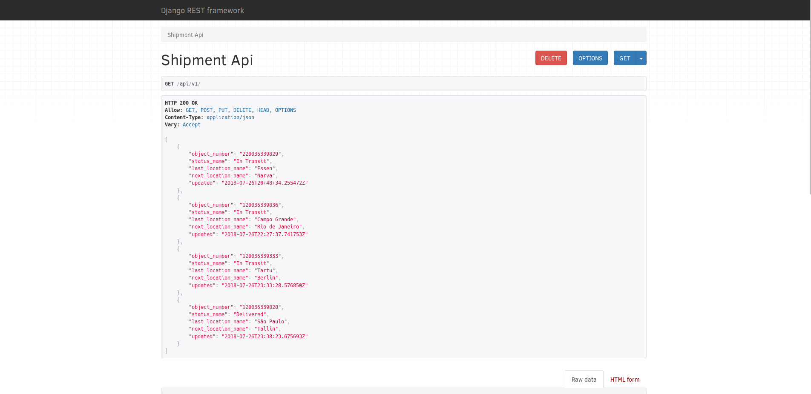

# Simple Shipments API Test 
> Django App 

### Task Description

## Python Developer Challenge
Please create REST API functionality to maintain a list of shipments 
(fields are freetext fields, up to your choice).

### Requirements

* Required functionality: list, retrieve, create, update.
* Python language with utilization of Django REST framework.
* No forms should be used
* Include tests (pytest, or phpunit, or etc).


### Notes

Code must be provided in a zip file.


## Technologies utilized
* Python 3.6.5
* Django 2.0.7
* PostgreSQL 10+

### Test Environment

### Installation

Any Operating System with docker/docker-compose installed:

```
a) git clone https://github.com/diemesleno/kuehne.git

b) cd kuehne

c) ./run.sh
```

## Some screenshots

### Main Page


### Admin Page


## Release History
* 1.0.0
    * First release
* 0.1.1
    * Fixing issues
* 0.1.0
    * Testing deployment
* 0.0.9
    * Creation of Dockerfiles
* 0.0.8
    * Preparing files to production
* 0.0.7
    * Development of Tests
* 0.0.6
    * Development of  Blueprints
* 0.0.5
    * Development of  cli app
* 0.0.4 
    * Development of configurations
* 0.0.3
    * Development of views Views
* 0.0.2
    * Development of project Models
* 0.0.1
    * Project kuehne creation

## Meta

Diemesleno Souza Carvalho – [@diemesleno](https://twitter.com/diemesleno) – diemesleno@gmail.com


[https://github.com/diemesleno/kuehne](https://github.com/diemesleno/)